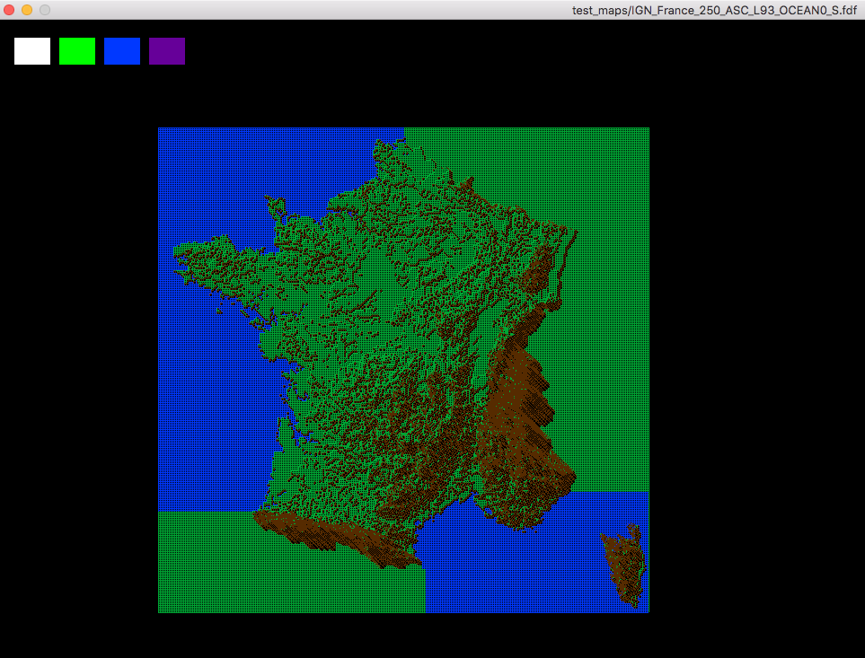

# FdF

This project is about creating a 3D graphic representation (in wireframe) of relief landscape. It uses the Minilibx graphic library so you need it to compile.

Usage: ./fdf [mapfile]

You can use the following buttons to move, resize or change the color of the drawing : arrow keys, space key, +-/* keys on num. pad and mouse scroll wheel.

